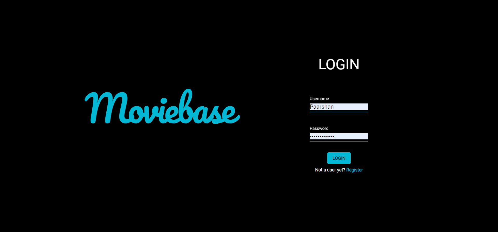
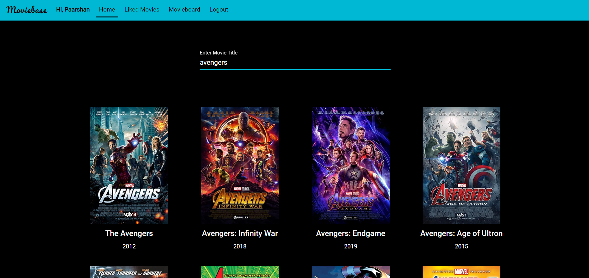
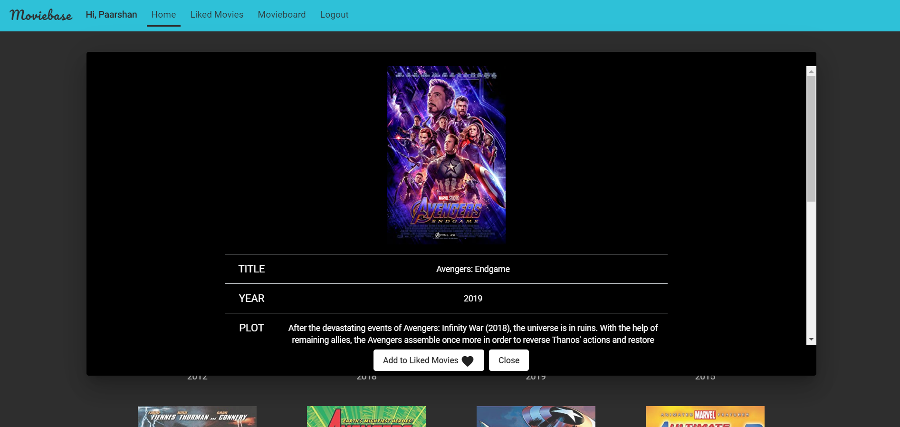
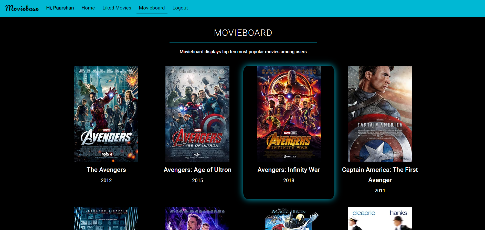

# MOVIEBASE
- A Web Application developed using Angular and Django powered by OMDBapi provides all the details of a movie just by typing its name.
- Users can also add movies of their choice to their liked list and can also view the most popular movies among other users in Movieboard.

## Screenshots

| Login | Registration |
:-------------------------:|:-------------------------:
 | 

| Search Movies | Movie Details |
:-------------------------:|:-------------------------:
 | 

| Liked Movies | Movieboard |
:-------------------------:|:-------------------------:
 | 
